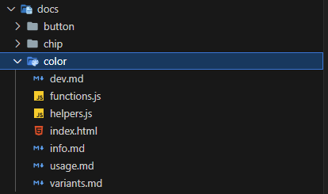

<div markdown class="p-4">

# Opera UI - Introduction

Hiện tại em tự viết script chuyển từ md sang html.

Do không md bên trong div được nên em tách cấu trúc thư mục như hình: 



- `index.html`: cố định, em đã setup sẵn, chỉ cần mỗi doc bỏ file này vào là script sẽ tự generate ra
- `info.md`: tiêu đề của doc, nếu là các file không cần component tabs, tất cả nội dung sẽ viết vào file này (intro, install,...)
- `variants.md`: là file nội dung cho variants tabs, tương tự với usage và dev
- `functions.js`: là file chứa các function global cho riêng page đó, ví dụ các func tạo custom toast hoặc các custom func của component khác
- `helpers.js`: là file chứa các func hỗ trợ cho trang ví dụ như click to copy color, hover to show some thing...

## style:

- Hiện tại style là style .md giống với github (font IBM), do ghi đè nên các markdown phải đặt trong 1 div có attribute là markdown

ví dụ:
```js
<div markdown >
... markdown content
</div>
```

</div>